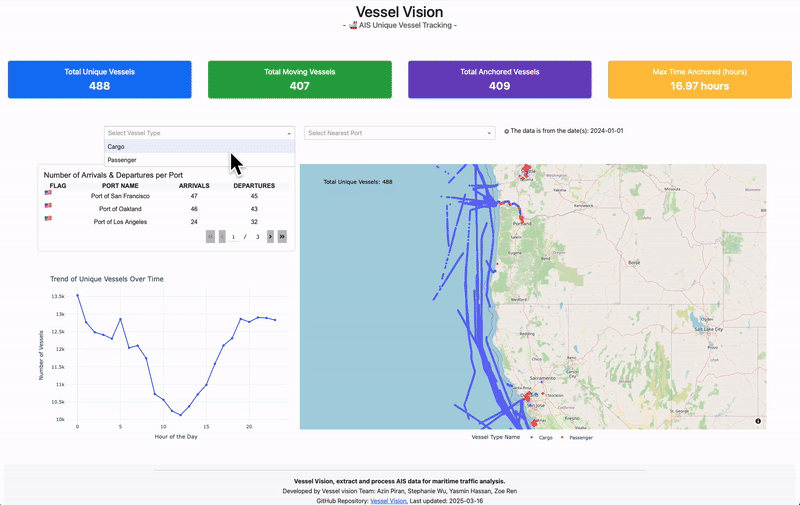

# Vessel Vision 🚢🌊📊🗺️

## About
**Vessel Vision** is an interactive dashboard that visualizes and analyzes Automatic Identification System (AIS) data for maritime traffic. This project focuses on tracking vessel movements along the West Coast of North America, providing real-time insights into maritime activity. By integrating dynamic filtering options and interactive visualizations, the dashboard addresses gaps in traditional maritime traffic analysis tools, enabling better decision-making in the maritime industry.

**Keywords**: AIS data, maritime traffic, vessel tracking, real-time analysis, West Coast, interactive visualization, dashboard, shipping activity, port congestion.

## Introduction
This project focuses on extracting and processing Automatic Identification System (AIS) data for maritime traffic analysis. The data is sourced from the National Oceanic and Atmospheric Administration (NOAA), a scientific agency under the U.S. Department of Commerce, which provides valuable insights into oceanic, atmospheric, and maritime conditions.

The dataset captures vessel movements on **January 1, 2024** (New Year's Day). These dates were selected due to the heightened shipping activity typically observed around the year-end, driven by operational surges and year-end deadlines.

The maritime industry in West Coast of North America requires real-time access to vessel movement data for effective decision-making. Traditional tools lack **interactive visualizations** and **custom filtering**, making it difficult to analyze trends efficiently. Our dashboard will address this gap by providing an intuitive and interactive platform to explore AIS (Automatic Identification System) data.

---

## Contributors

Azin Piran

Stephanie Wu

Yasmin Hassan

Zoe Ren

---

## Demo GIF



---
## Dashboard Usage

In the Dashboard, you can select different dates, vessel types, nearest ports, and vessel names to explore vessel tracking data. 

Through the charts and cards, you can gain insights into Traffic Comparison by Hour, the Number of Arrivals & Departures per Port, the Total Number of Unique Vessels, Moving Vessels, and Anchored Vessels, as well as the Maximum Time Anchored. 

You can also zoom in and out on the map to observe vessel movements and assess port congestion levels.

👉 **[View on Render](https://vessel-vision.onrender.com)**  
---
***IMPORTANT NOTE; PLEASE READ***

There have been reports of the data not showing up for the cards or map. If this is the case or it is taking too long, please view it in local.

Please note that in local the port chart loads first because we do not have to search as many rows for the output numbers, also the map is slow due to the computations in the tooltips for the same reason, and this is why you will see the port chart consistently loading first in this described manner. 

## Run in local

### Step 1: Setting Up the Environment
Ensure that all necessary dependencies are installed by setting up the environment:
```bash
conda env create -f environment.yaml
conda activate vessel-vision
```

### Step 2: Installing Dependencies and Running the Dashboard  
Run the following command to start the Dash web application:
```bash
python -m pip install -r requirements.txt
```
Then, start the Dash web application:
```bash
python src/app.py
```

This will launch the interactive web dashboard **Vessel Vision**.

---

## Data Availability
The AIS data for the chosen dates are stored in the data folder in split form, our dashboard will process the data.

### Additional Download Links:
- **Download AIS Data 2023**: [NOAA Link for AIS Data 2023](https://www.coast.noaa.gov/htdata/CMSP/AISDataHandler/2023/index.html)
- **Download AIS Data 2024**: [NOAA Link for AIS Data 2024](https://coast.noaa.gov/htdata/CMSP/AISDataHandler/2024/index.html)

---

## Get involved 

Interested in contributing? Check out the [contributing guidelines](https://github.com/UBC-MDS/DSCI-532_2025_5_vessel-vision/blob/main/CONTRIBUTING.md). Please note that this project is released with a [Code of Conduct](https://github.com/UBC-MDS/DSCI-532_2025_5_vessel-vision/blob/main/CODE_OF_CONDUCT.md). By contributing to this project, you agree to abide by its terms.

---

## Contact us 

If you want to report a problem or suggest an enhancement, please feel free to open an issue at this github repository [open an issue](https://github.com/UBC-MDS/DSCI-532_2025_5_vessel-vision/issues).
