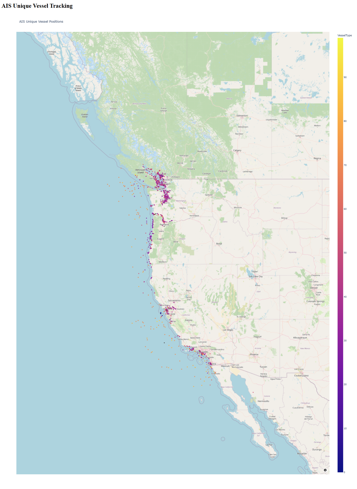

# Vessel Vision

## 1. Introduction
This project focuses on extracting and processing Automatic Identification System (AIS) data for maritime traffic analysis. The data is sourced from the National Oceanic and Atmospheric Administration (NOAA), a scientific agency under the U.S. Department of Commerce, which provides valuable insights into oceanic, atmospheric, and maritime conditions.

The dataset used in this extraction process pertains to two specific dates:
- **December 31, 2023** (New Year's Eve)
- **January 1, 2024** (New Year's Day)

These dates were selected due to the heightened shipping activity typically observed around the year-end, which is driven by operational surges and year-end deadlines.

---

## 2. About AIS Data
AIS (Automatic Identification System) is a vital tracking system used for identifying and locating vessels. It serves essential purposes in navigation, safety, and maritime traffic monitoring. AIS data is continuously broadcasted by vessels and received by land stations and satellites.

### Key Fields in AIS Data:
- **MMSI**: Maritime Mobile Service Identity, a unique identifier for each vessel.
- **Timestamp**: The date and time when the AIS message was recorded.
- **Latitude & Longitude**: Geographical coordinates of the vessel.
- **Speed (knots)**: Speed of the vessel over the ground.
- **Course (degrees)**: The direction in which the vessel is traveling.
- **Heading (degrees)**: The actual heading or direction of the vessel.
- **Ship Type**: Classification of the vessel (e.g., cargo, tanker, fishing vessel).

---

## 3. Data Availability
The AIS data for the chosen dates has already been downloaded from NOAA and can be accessed via the following public Google Drive link:

- **Download AIS Data**: [Google Drive Link for AIS Data](https://drive.google.com/drive/folders/1zxJuSRigLEg4iY1pnUgW-Z49s2TEKEip?usp=sharing)

Once downloaded, store the files in the `data` folder of this project. You will then need to execute the two Python scripts (`data_extraction.py` and `data_preprocessing.py`) in the Jupyter notebook to process the data.

### Additional Download Links:
- **Download AIS Data 2023**: [NOAA Link for AIS Data 2023](https://www.coast.noaa.gov/htdata/CMSP/AISDataHandler/2023/index.html)
- **Download AIS Data 2024**: [NOAA Link for AIS Data 2024](https://coast.noaa.gov/htdata/CMSP/AISDataHandler/2024/index.html)

---

## 4. Data Extraction Process
The data extraction process is automated through Python scripts. The flow is as follows:

1. **Environment Setup**: Ensure that the environment is set up correctly using the `environment.yaml` file provided. This file includes all necessary dependencies for the project.

2. **Data Extraction**:
   - Run the `data_extraction.ipynb` script to download and extract the raw AIS data.
   
3. **Data Preprocessing**:
   - Run the `data_preprocessing.ipynb` script to clean, process, and organize the extracted data.
   - After preprocessing, the cleaned dataset will be saved in the `data/processed/` folder under the filename `ais_west_coast.csv`.

---

## 5. Dashboard Visualization
Once the data is processed, a dashboard can be created to visualize the unique vessel positions on a map. This is achieved by running the following Python script:

- **Dashboard**: To visualize the data, run the `app.py` script. This will launch an interactive web dashboard, which can be accessed in any browser.

---

## 6. Instructions for Running the Project

### Step 1: Setting Up the Environment
Ensure that all necessary dependencies are installed by setting up the environment:
```bash
conda env create -f environment.yaml
conda activate vessel-vision
```
### Step 2: Setting Up the Environment
1. Run the data_extraction.ipynb script to download and extract the AIS data.
2. Run the data_preprocessing.ipynb script to clean and preprocess the data.

### Step 3: Running the Dashboard
Run the following command to start the Dash web application:
```bash
python app.py
```

This will launch a web dashboard that shows the AIS vessel tracking map.


