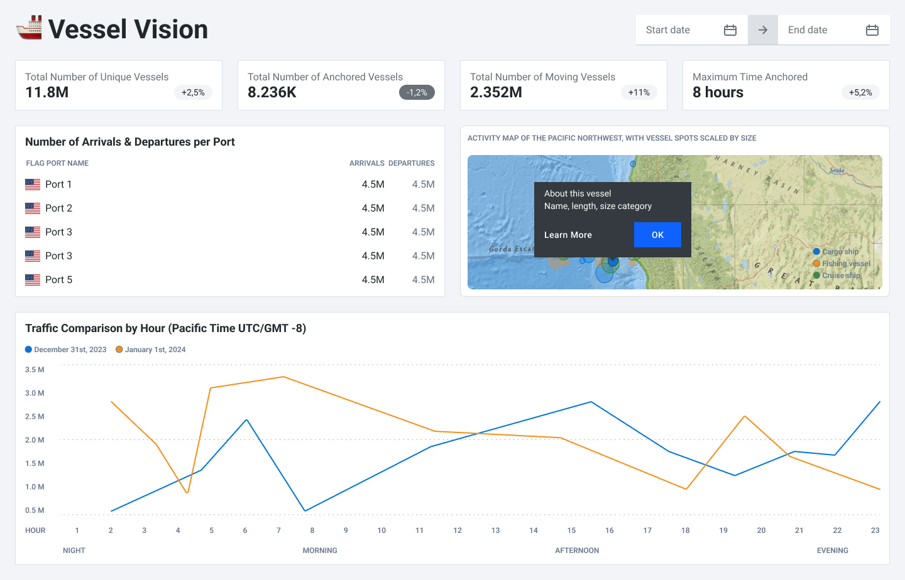

# Vessel Vision Dashboard Proposal

## **1. Motivation and Purpose**

### **Project Background**

We are a team of data science students at UBC, working on an interactive dashboard as part of our DSCI 532 course. Our goal is to build a **West Coast of North America AIS Vessel Tracking Dashboard** to enable real-time and historical analysis of ship movements in West Coast of North America. 

### **Target Audience**

Our dashboard is designed for:

- **Port Authorities on the West Coast of North America**
- **Shipping and Logistics Companies**
- **Marine Researchers and Environmental Analysts**
- **Coast Guard and Security Agencies**

### **Problem Statement**

The maritime industry in West Coast of North America requires real-time access to vessel movement data for effective decision-making. Traditional tools lack **interactive visualizations** and **custom filtering**, making it difficult to analyze trends efficiently. Our dashboard will address this gap by providing an intuitive and interactive platform to explore AIS (Automatic Identification System) data.

---

## **2. Description of the Data**

This project utilizes Automatic Identification System (AIS) data from the National Oceanic and Atmospheric Administration (NOAA) for maritime traffic analysis. 

The dataset captures vessel movements on **December 31, 2023** (New Year's Eve) and **January 1, 2024** (New Year's Day). These dates were selected due to the heightened shipping activity typically observed around the year-end, driven by operational surges and year-end deadlines.

The target area, **the West Coast of North America** covers Canada, USA, and Mexico’s Pacific coasts, within the latitude range 20°N to 60°N and longitude range -140°W to -110°W).

The dataset contains 1,048,575 records, each with 17 associated AIS variables. Below are the **definitions of AIS terms** to help understanding.

- **MMSI (Maritime Mobile Service Identity)** – Unique vessel identifier
- **BaseDateTime** – Timestamp of the data entry
- **LAT, LON** – Latitude and Longitude (vessel position)
- **SOG (Speed Over Ground)** – The actual speed of the vessel over the Earth's surface, measured in knots.
- **COG (Course Over Ground)** – The actual direction in which a vessel is moving relative to the Earth’s surface, measured from 0° to 360°.
- **Heading** – The direction the vessel’s bow (front) is pointing, measured from 0° to 359°. (Heading 511 means No valid heading data available)
- **VesselName** – Name of the Vessel
- **Status** - Status of the Vessel
- **IMO, CallSign** – Additional Vessel identifiers
- **VesselType** – Vessel type (i.e. 30 - Fishing Vessel, 60 - Passenger Vessel, 70 - General Cargo Ship)
- **Length, Width, Draft** – Vessel dimensions
- **Cargo Type** – Type of cargo being transported (i.e. 30- Fishing, 60 - Passenger, 80 - Oil Tanker)
- **TransceiverClass** - Type of transceiver the vessel used(Class A and Class B)

We plan to visualize the following key AIS variables to understand vessel movements and operational patterns. This dashboard will help our target audience address the research questions outlined in the next section. For example:

- **Vessel Identification & Characteristics** (`MMSI`, `VesselType`, `Cargo Type`, etc.)
- **Traffic Condition**(`SOG`,`BaseDateTime`, etc.)
- **Port Arrivals & Departures**(`COG`,`Status`, `LAT`, `LON`, etc.)
- **Anchored Vessel activity** (`Status`,`BaseDateTime`, `MMSI`, etc.)
...

### **Planned Data Processing and Feature Engineering**

- **Geographic Filtering**: Select only vessels **within the West Coast of North America region** (LAT 20°N to 60°N, LON -140°W to -110°W).
- **Time-Based Trends**: Analyze vessel movement patterns over different time periods.
- **Vessel Traffic Density**: Visualize congested areas in the ports.
- **Derived Variables**: Compute daily vessel counts, speed distributions, and time spent in certain zones.

---

## **3. Research Questions and Usage Scenarios**

### **Research Questions**

- How many vessels are active?
- What are the most common vessel types?
- How do vessel speed and movement patterns vary?
- Where are the most congested areas and how does traffic density change over time?
- How does vessel movement on December 31, 2023, compare to January 1, 2024?
- How many vessels arrived and departed during this period?
- How many vessels were anchored, and where were the most common anchoring locations?
- What was the maximum time a vessel remained anchored?

### **User Story: Port Operations Manager**

> John, a port operations manager, analyzes vessel congestion at the Port of West Coast, North America for December 2023 – January 2024. Using the dashboard, he views a vessel density heatmap, identifying high congestion near Burrard Inlet. He schedules additional tugboats to assist cargo ships and downloads a weekly vessel traffic report to optimize berthing schedules.

### **User Story: Marine Researcher**

> Lisa, a marine researcher, studies vessel traffic impact on marine life. She filters the dashboard for tankers and cargo ships to locate high-traffic zones near protected marine areas. These insights help her propose new conservation policies and advocate for no-go zones to protect biodiversity.

---

## **4. App Sketch & Brief Description**

The app contains a landing page that shows the following KPIs

1- Traffic Comparison by Hour – Compare movement trends between Dec 31 2023 and Jan 1 2024

2- Number of Arrivals & Departures per Port

3- Total Number of Unique Vessels

4- Total Number of Anchored Vessels – Count of vessels marked with "anchored" status.

5- Maximum Time Anchored – The longest duration a vessel remained anchored on a given day

Users can filter vessel activity by date (New Year's Eve 2023 or New Year's Day 2024) using a datepicker in the top-right corner, updating the number billboards and map. The map includes a legend for vessel types, with semi-transparent circles (scaled by size) instead of boat symbols for visibility. A tooltip provides vessel details, and selecting a vessel makes its circle opaque, allowing users to easily switch selections.

---

This proposal outlines our vision for the  AIS Vessel Tracking Dashboard. We aim to create a user-friendly tool for port authorities, researchers, and security agencies to **analyze vessel movement data** efficiently. 🚢📊
